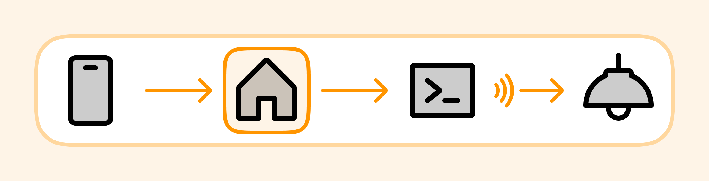

# homebridge-rf-lights 

This Homebridge plug-in transforms standard remote-controlled lights to smart lights with [Python scripts](https://github.com/xtai/py-rf-lights).

## Features

- Add multiple lights.
- Control light brightness.
- Individually control different parts of a single light.
- A set of virtual toggles in the Home App to replicate the remote control.

## Usage

This [example Homebridge configuration](https://github.com/xtai/homebridge-rf-lights/blob/main/example-config.json) file includes three lights.

Check [the py-rf-lights repository](https://github.com/xtai/py-rf-lights) for more usage information.
